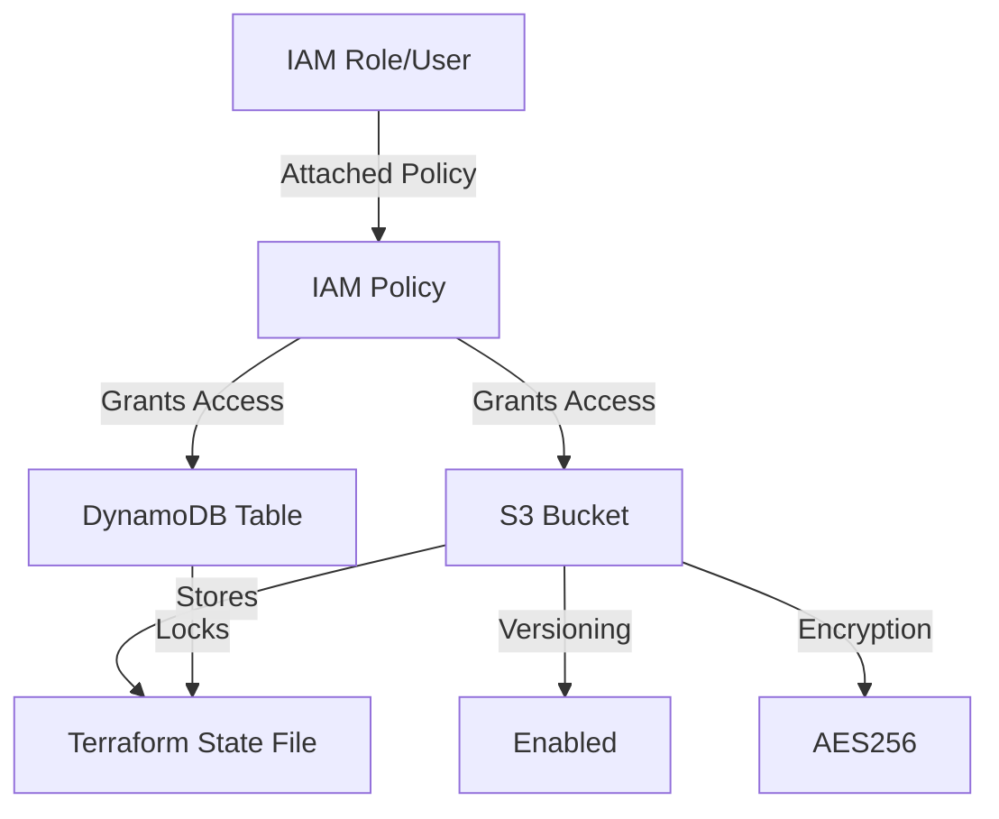

# set up

required for Terraform state management in AWS, including S3 for storing the state and DynamoDB for state locking:



---

### **1. Create an S3 Bucket**

The S3 bucket will store the Terraform state file.

```bash
aws s3api create-bucket --bucket <your-unique-bucket-name> --region <region> --create-bucket-configuration LocationConstraint=<region>
```

**Example:**

```bash
aws s3api create-bucket --bucket my-terraform-state-bucket --region us-east-1 --create-bucket-configuration LocationConstraint=us-east-1
```

---

### **2. Enable Versioning on the S3 Bucket**

Versioning allows you to recover from accidental deletions or overwrites of the state file.

```bash
aws s3api put-bucket-versioning --bucket <your-unique-bucket-name> --versioning-configuration Status=Enabled
```

**Example:**

```bash
aws s3api put-bucket-versioning --bucket my-terraform-state-bucket --versioning-configuration Status=Enabled
```

---

### **3. Enable Server-Side Encryption**

Ensure data at rest in the S3 bucket is encrypted.

```bash
aws s3api put-bucket-encryption --bucket <your-unique-bucket-name> --server-side-encryption-configuration '{"Rules":[{"ApplyServerSideEncryptionByDefault":{"SSEAlgorithm":"AES256"}}]}'
```

**Example:**

```bash
aws s3api put-bucket-encryption --bucket my-terraform-state-bucket --server-side-encryption-configuration '{"Rules":[{"ApplyServerSideEncryptionByDefault":{"SSEAlgorithm":"AES256"}}]}'
```

---

### **4. Create a DynamoDB Table for State Locking**

This table ensures that only one Terraform process modifies the state at a time.

```bash
aws dynamodb create-table \
    --table-name <your-lock-table-name> \
    --attribute-definitions AttributeName=LockID,AttributeType=S \
    --key-schema AttributeName=LockID,KeyType=HASH \
    --billing-mode PAY_PER_REQUEST
```

**Example:**

```bash
aws dynamodb create-table \
    --table-name terraform-lock-table \
    --attribute-definitions AttributeName=LockID,AttributeType=S \
    --key-schema AttributeName=LockID,KeyType=HASH \
    --billing-mode PAY_PER_REQUEST
```

---

### **5. Set Up IAM Policies and Roles**

Create IAM policies to allow access to the S3 bucket and DynamoDB table.

#### Create an IAM Policy:

```bash
aws iam create-policy --policy-name TerraformStatePolicy --policy-document file://policy.json
```

**Example `policy.json`**:

```json
{
  "Version": "2012-10-17",
  "Statement": [
    {
      "Effect": "Allow",
      "Action": [
        "s3:GetObject",
        "s3:PutObject",
        "s3:DeleteObject",
        "s3:ListBucket"
      ],
      "Resource": [
        "arn:aws:s3:::my-terraform-state-bucket",
        "arn:aws:s3:::my-terraform-state-bucket/*"
      ]
    },
    {
      "Effect": "Allow",
      "Action": [
        "dynamodb:PutItem",
        "dynamodb:GetItem",
        "dynamodb:DeleteItem",
        "dynamodb:Scan"
      ],
      "Resource": "arn:aws:dynamodb:us-east-1:123456789012:table/terraform-lock-table"
    }
  ]
}
```

---

#### Attach the Policy to an IAM Role or User:

```bash
aws iam attach-user-policy --user-name <user-name> --policy-arn <policy-arn>
```

**Example:**

```bash
aws iam attach-user-policy --user-name terraform-user --policy-arn arn:aws:iam::123456789012:policy/TerraformStatePolicy
```

---

### **6. Test the Setup**

Verify the resources are created and accessible:

- **S3 Bucket:**
  ```bash
  aws s3 ls s3://<your-unique-bucket-name>
  ```
- **DynamoDB Table:**
  ```bash
  aws dynamodb describe-table --table-name <your-lock-table-name>
  ```

---

### **7. Configure Terraform to Use the Backend**

After creating the resources, update your Terraform configuration to use the S3 backend and DynamoDB for locking:

```hcl
terraform {
  backend "s3" {
    bucket         = "my-terraform-state-bucket"
    key            = "terraform/state"
    region         = "us-east-1"
    dynamodb_table = "terraform-lock-table"
    encrypt        = true
  }
}
```
